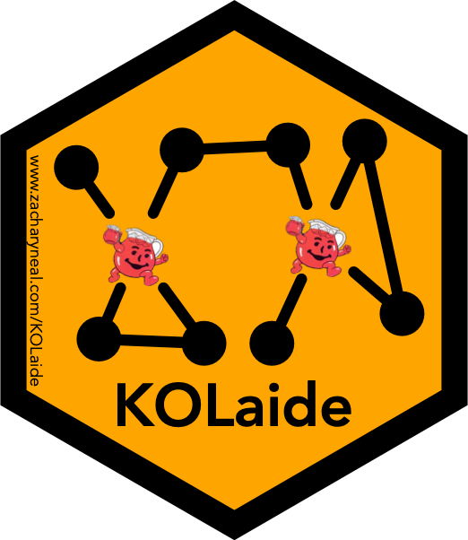

# grand 

<!-- badges: start -->

[](https://cran.r-project.org/package=KOLaid)
[](https://cran.r-project.org/package=KOLaid)
[](https://cran.r-project.org/package=KOLaid)
[](https://CRAN.R-project.org/package=KOLaid)
<!-- badges: end -->


## Welcome
Welcome to the `KOLaid` package\! The `KOLaid` package assists researchers in choosing Key Opinion Leaders (KOLs) in a network to help disseminate or encourage adoption of an innovation by other network members. Potential KOL teams are evaluated using the ABCDE framework, which considers: (1) the team members' Availability, (2) the Breadth of the team's network coverage, (3) the Cost of recruiting a team of a given size, and (4) the Diversity of the team's members, (5) which are pooled into a single Evaluation score.

## Installation
The /release branch contains the current CRAN release of the `KOLaid` package. You can install it from [CRAN](https://CRAN.R-project.org) with:
``` r
install.packages("KOLaid")
```

The /devel branch contains the working beta version of the next release of the `KOLaid` package. All the functions are documented and have undergone various levels of preliminary debugging, so they should mostly work, but there are no guarantees. Feel free to use the devel version (with caution), and let us know if you run into any problems. You can install it You can install from GitHub with:
``` r
library(devtools)
install_github("zpneal/KOLaid", ref = "devel", build_vignettes = TRUE)
```

## Dependencies
The `KOLaid` package adopts the [tinyverse](https://www.tinyverse.org/) philosophy, and therefore aims to keep dependencies at a minimum.
